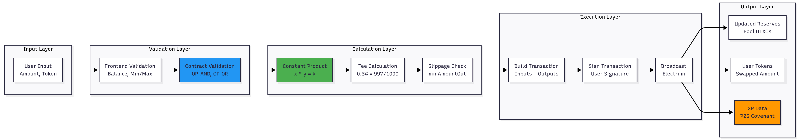
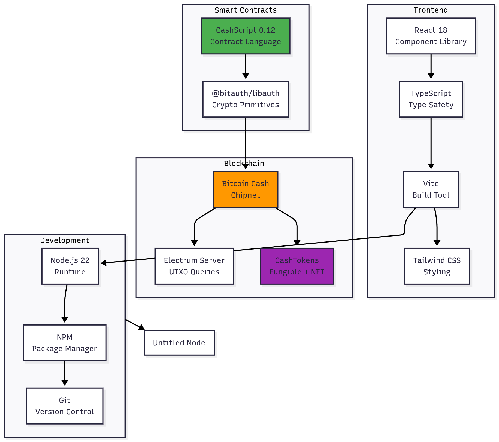

# Chronos DEX - Technical Architecture

## System Overview


## Swap Transaction Flow


## Data Flow Architecture



## Contract State Management


## UTXO Management


## Technology Stack



## File Structure

```
chronos-dex/
├── contracts/
│   ├── LiquidityPool_TRUE_LAYLA.cash    # Main AMM contract with Layla CHIPs
│   ├── GamificationVault.cash           # XP tracking contract
│   ├── LiquidityPool_LAYLA.json         # Compiled contract artifact
│   └── GamificationVault.json           # Compiled vault artifact
│
├── frontend/
│   ├── src/
│   │   ├── components/
│   │   │   ├── SwapPage.tsx             # Swap UI
│   │   │   ├── PoolPage.tsx             # Liquidity UI
│   │   │   └── Dashboard.tsx            # Stats & leaderboard
│   │   ├── contracts/
│   │   │   ├── LiquidityPool_LAYLA.json # Contract artifact (copy)
│   │   │   └── GamificationVault.json   # Vault artifact (copy)
│   │   ├── contractService.ts           # Contract interaction logic
│   │   ├── walletService.ts             # Wallet management
│   │   └── App.tsx                      # Main app component
│   ├── .env.local                       # Environment variables
│   └── package.json
│
├── scripts/
│   ├── deploy-and-init.mjs              # Deployment script
│   ├── mint-tokens.mjs                  # Token minting
│   └── check-pool-utxos.mjs             # Pool inspection
│
└── README.md
```

## Key Design Decisions

### 1. Single-Transaction Swaps

**Decision:** Combine user UTXO and pool UTXOs in one transaction  
**Rationale:** Eliminates approval step, better UX, atomic execution  
**Implementation:** 4 inputs (3 pool + 1 user), 5 outputs

### 2. Layla CHIP Usage

**Decision:** Use OP_AND, OP_OR, OP_XOR for validation  
**Rationale:** Required for chipnet track, more gas-efficient  
**Implementation:** Lines 143-145, 158-160, 177-179 in contract

### 3. P2S Covenants

**Decision:** Output 4 always creates P2S with XP data  
**Rationale:** Enables trustless gamification, Battle.cash integration  
**Implementation:** NFT commitment = userPkh + amountIn + poolId

### 4. Composite LP Tokens

**Decision:** LP tokens are FT + NFT  
**Rationale:** Fungible for trading, NFT proves liquidity provision  
**Implementation:** NFT commitment = locktime + initial_xp

---

Built with ❤️ for Bitcoin Cash
