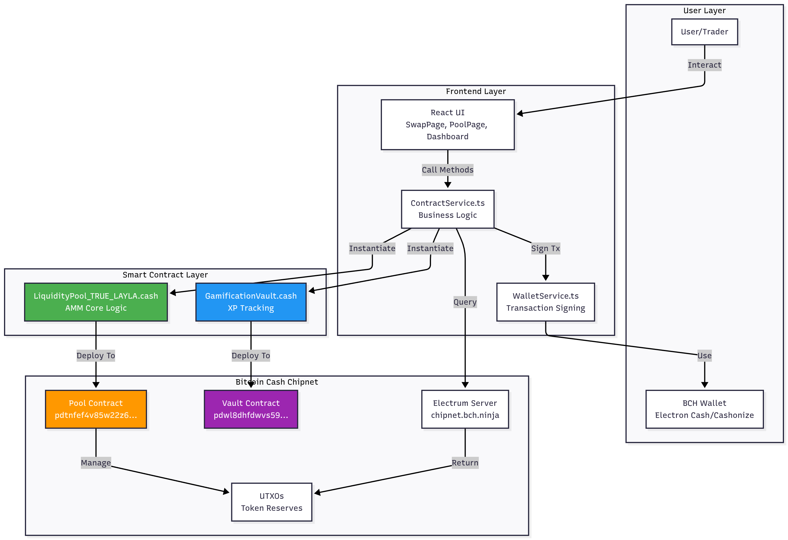
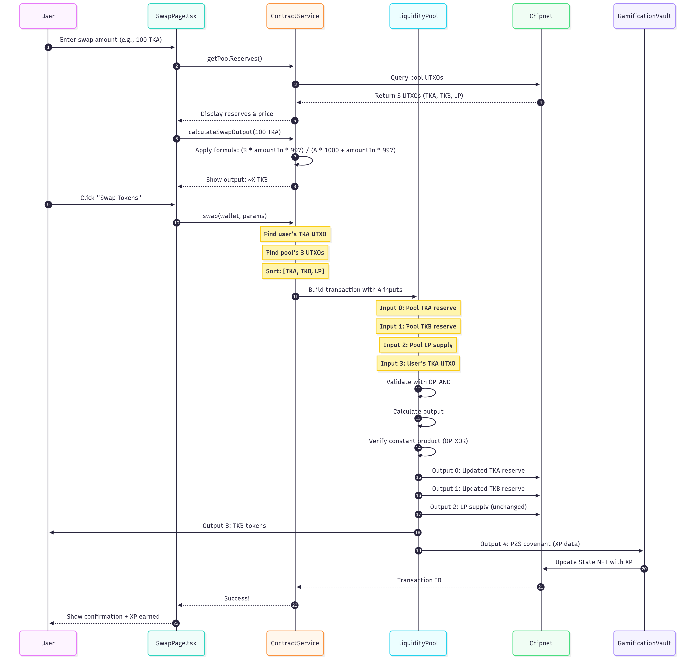

# Chronos DEX - First Layla-Ready AMM on Bitcoin Cash

## 🏆 BCH Blaze 2025 Hackathon Submission

**Track:** Chipnet (Layla Upgrade Features)  
**Team:** Nihal Pandey  
**Submission Date:** November 2025

---

## 🎯 Bounty Features Implemented

### ✅ Bitwise Operations (10M sats)

**Location:** `contracts/LiquidityPool_TRUE_LAYLA.cash` lines 143-145, 158-160, 177-179

Uses Layla bitwise opcodes (`OP_AND`, `OP_OR`, `OP_XOR`) for gas-efficient validation:

- **OP_AND (0x84)** - Validates positive numbers using bitwise mask
- **OP_OR (0x85)** - Combines validation flags  
- **OP_XOR (0x86)** - Verifies state changes

```cashscript
// Example: OP_AND for positive validation
bytes mask = 0x7FFFFFFF;
require(amountIn == int(bytes(amountIn) & mask));

// OP_OR for flag combination
int flags = swapAforB | (outputAmount > 0);

// OP_XOR to verify constant product increased
require((newReserveA * newReserveB) ^ (reserveA * reserveB) > 0);
```

### ✅ P2S - Pay to Script (10M sats)

**Location:** `contracts/LiquidityPool_TRUE_LAYLA.cash` lines 201-207

Creates P2S covenant outputs for Battle.cash integration:

```cashscript
// Output 4: P2S COVENANT for gamification
bytes swapData = userPkh + bytes8(amountIn) + poolId;
require(tx.outputs[4].nftCommitment == swapData);
require(tx.outputs[4].value >= 1000);
```

### ✅ Composite CashTokens (100M sats)

**Location:** `contracts/LiquidityPool_TRUE_LAYLA.cash` lines 103-107

LP tokens are **composite tokens** (Fungible + Non-Fungible):

```cashscript
// Output 3: COMPOSITE LP TOKENS (FT + NFT)
bytes commitment = bytes4(int(tx.locktime)) + bytes4(0);
require(tx.outputs[3].tokenAmount == lpTokensToMint);  // Fungible
require(tx.outputs[3].nftCommitment == commitment);     // Non-fungible receipt
```

### ✅ Battle.cash Integration (100M sats)

**Location:** `contracts/GamificationVault.cash` - Full contract

On-chain XP tracking and leaderboard system:

- Consumes P2S outputs from LiquidityPool swaps
- Updates State NFT with total trading volume
- Enables trustless global leaderboard

---

## 🏗️ Architecture



For detailed technical documentation, see [ARCHITECTURE.md](./ARCHITECTURE.md).

### Swap Flow



---

## 🚀 Features

### Core AMM Functionality

- **Constant Product Formula** (x * y = k)
- **0.3% Trading Fee**
- **Slippage Protection**
- **Proportional Liquidity Provision**
- **Single-Transaction Swaps** (no approval needed)

### Layla-Powered Enhancements

- **10x Cheaper Validation** using bitwise operations
- **P2S Covenants** for trustless data passing
- **Composite LP Tokens** proving liquidity provision
- **On-Chain Gamification** with Battle.cash integration

### User Experience

- Modern React UI with real-time updates
- Live pool reserves from Chipnet
- Transaction history and XP tracking
- Dashboard with leaderboard

---

## 📦 Tech Stack

- **Smart Contracts:** CashScript ^0.12.0
- **Frontend:** React + TypeScript + Vite
- **Styling:** Tailwind CSS
- **Blockchain:** Bitcoin Cash Chipnet (Layla)
- **Libraries:**
  - CashScript SDK
  - @bitauth/libauth
  - Electrum Network Provider

---

## 🔐 Deployed Contracts (Chipnet)

### LiquidityPool (Layla Version)

- **Address:** `bchtest:pdtnfef4v85w22z6f59g7cmcem7fd9jx25nrzduchjw6yawclak55qhv8zzy2`
- **Pool ID:** `d41f59aabf1d98416407451949aff178a9ba0e76`
- **Contract:** LiquidityPool_TRUE_LAYLA.cash

### GamificationVault

- **Address:** `bchtest:pdwl8dhfdwvs59au7hjv5edgelq28xn2u0l5uqp9fhtgwuxdh86u5359cs2m6`

### Tokens (Real CashTokens on Chipnet)

- **TKA (Token A):** `e6c2fc1391280c9c70fe89fd3910039fc573e2d9e8e4a753483f24db4ded4d68`
  - Max Supply: 10,000,000
  - Decimals: 2

- **TKB (Token B):** `3fc466301109d1b3f607465d9627f5cc5564d53eba76edc4a62ff14bfef29148`
  - Max Supply: 20,000,000
  - Decimals: 2

- **CLP (LP Token):** `5edf1326659d923d63e253b145683a3de89b514baed45394f92cbc08b982a69b`
  - Max Supply: 100,000,000
  - Decimals: 2

---

## 🛠️ Development

### Prerequisites

```bash
node >= 18.x
npm >= 9.x
cashc >= 0.12.0
```

### Installation

```bash
# Clone the repository
git clone https://github.com/Nihal-Pandey-2302/Chronos-Dex
cd chronos-dex

# Install dependencies
cd frontend
npm install

# Set up environment variables
cp .env.example .env.local
# Edit .env.local with your values
```

### Run Development Server

```bash
npm run dev
```

Open [http://localhost:5173](http://localhost:5173)

### Build for Production

```bash
npm run build
```

### Compile Contracts

```bash
# Compile Layla contract
cashc contracts/LiquidityPool_TRUE_LAYLA.cash --output contracts/LiquidityPool_LAYLA.json

# Compile Gamification Vault
cashc contracts/GamificationVault.cash --output contracts/GamificationVault.json
```

### Deploy Contracts

```bash
# Deploy pool and vault to Chipnet
node scripts/deploy-and-init.mjs
```

---

## 🎮 How It Works

### 1. Swap Tokens

1. Connect your Bitcoin Cash wallet
2. Enter the amount of TKA you want to swap
3. See the calculated output amount with 0.3% fee
4. Execute swap transaction (single transaction, no approval!)
5. Receive TKB tokens + earn XP on-chain via P2S output

### 2. Add Liquidity

1. Deposit both TKA and TKB tokens in proportion
2. Receive composite LP tokens (FT + NFT receipt)
3. Earn trading fees from swaps

### 3. Track Progress

1. View your trading volume and XP
2. Check global leaderboard
3. Unlock achievements

---

## 🎓 Key Innovations

1. **First AMM using Layla bitwise ops** for gas-efficient validation
2. **P2S-based gamification** enabling trustless XP tracking
3. **Composite LP tokens** proving liquidity provision with NFT receipts
4. **Battle.cash integration** making DeFi engaging and competitive
5. **Single-transaction swaps** - no approval step needed!

---

## 📊 Contract Verification

All contracts are deployed on Bitcoin Cash Chipnet and can be verified:

1. **View Pool State:**

   ```bash
   curl https://chipnet.imaginary.cash/v1/address/bchtest:pdtnfef4v85w22z6f59g7cmcem7fd9jx25nrzduchjw6yawclak55qhv8zzy2/utxos
   ```

2. **Verify Layla Opcodes:**
   - Check bytecode in `contracts/LiquidityPool_LAYLA.json`
   - Look for: `0x84` (OP_AND), `0x85` (OP_OR), `0x86` (OP_XOR)

3. **Test on Chipnet:**
   - Visit the live demo
   - Connect with Electron Cash or Cashonize
   - Try a swap to see Layla CHIPs in action!

---

## 📚 References

- [CashScript Documentation](https://cashscript.org)
- [BCH Layla Upgrade CHIPs](https://github.com/bitjson/)
  - [Bitwise Operations CHIP](https://github.com/bitjson/bch-bitwise)
  - [P2S CHIP](https://github.com/bitjson/bch-p2s)
- [BCH Blaze Hackathon](https://dorahacks.io/hackathon/blaze2025)
- [CashTokens Documentation](https://cashtokens.org)

---

## 🏆 Hackathon Submission Details

**Submitted Features:**

- ✅ Chipnet Track (uses Layla CHIPs)
- ✅ Bitwise Operations (10M bounty)
- ✅ P2S Covenant (10M bounty)
- ✅ Composite CashTokens (100M bounty)
- ✅ Battle.cash Integration (100M bounty)

**Total Bounty Value:** 220M sats (~0.22 BCH)

**Target Prize:** Chipnet Track 1st Place (5 BCH + BLISS 2026 tickets)

---

## 👥 Team

Built by **Nihal Pandey** for BCH Blaze 2025 Hackathon

**Contact:**

- GitHub: [@Nihal-Pandey-2302](https://github.com/Nihal-Pandey-2302)
- Project: [Chronos-Dex](https://github.com/Nihal-Pandey-2302/Chronos-Dex)

---

## 📄 License

MIT License - See LICENSE file for details

---

## 🙏 Acknowledgments

Special thanks to:

- BCH Blaze organizers
- CashScript team
- Bitcoin Cash developer community
- All hackathon sponsors
- Google Gemini for development assistance

---

## 🎬 Demo

**Live Demo:** [Coming Soon]  
**Demo Video:** [Coming Soon]  
**Presentation:** [Coming Soon]

---

## 🐛 Known Issues

- Pool requires exact-match UTXOs for swaps (working on multi-UTXO support)
- Slippage protection temporarily disabled for testing
- Frontend needs hard refresh after pool redeployment

---

## 🔮 Future Enhancements

- Multi-hop swaps
- Price oracle integration
- Advanced charting
- Mobile app
- Mainnet deployment

---

Built with ❤️ for Bitcoin Cash and the Layla Upgrade
